# Git Lesson 

- Intial Commit 

- Create branch 

-  Add+Push Commit
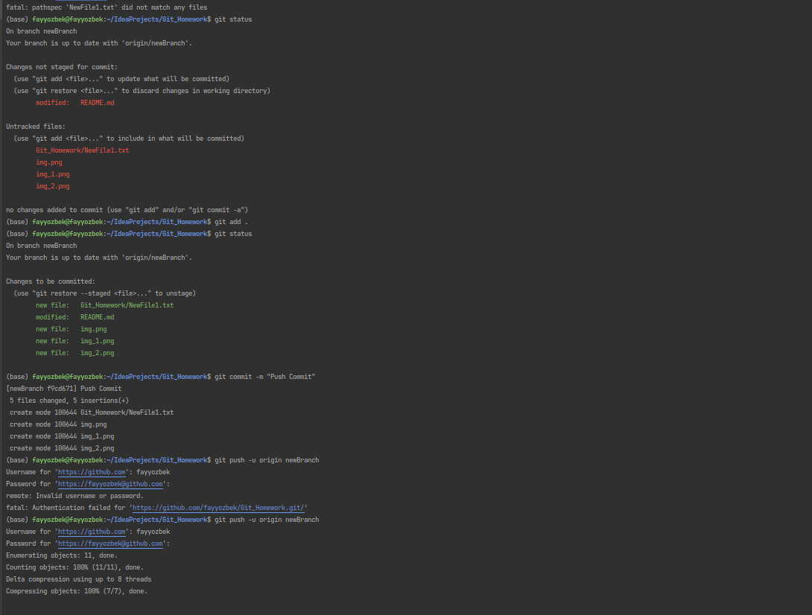
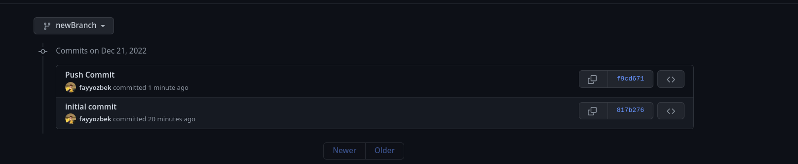
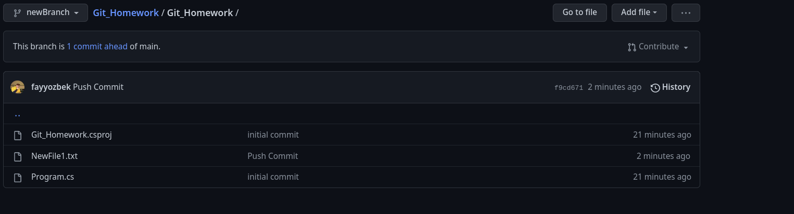
- Edit commit
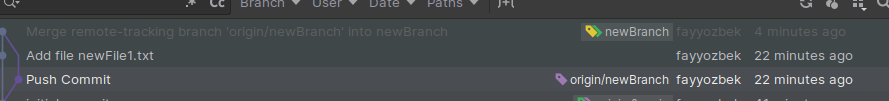
- Change Author

- Reset branch to commit

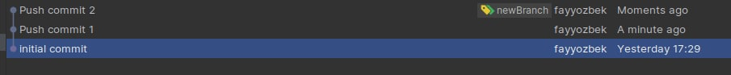
- Squash Commit's
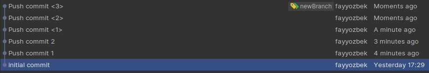
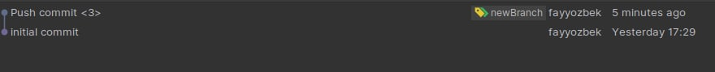
-  Rebase 
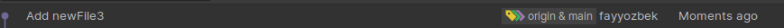
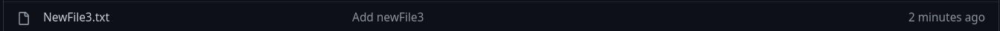
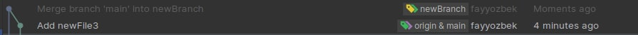
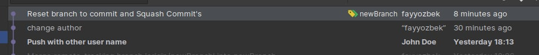
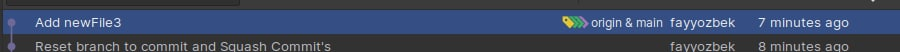
- Pull Request: Create a merge commit
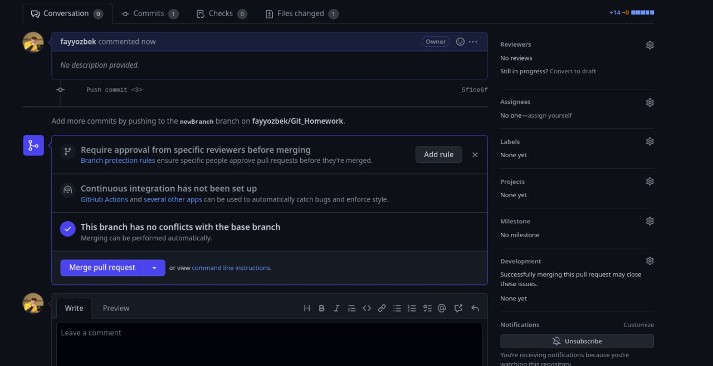
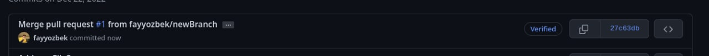
- Pull Request: Squash and merge