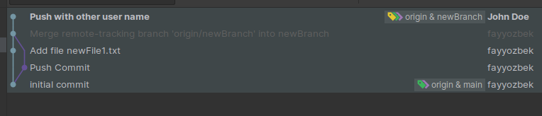
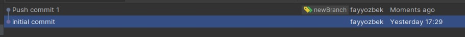

# Git Lesson 

- Intial Commit 

- Create branch 

-  Add+Push Commit

- Edit commit

- Change Author

- Reset branch to commit

- Squash Commit's

-  Rebase 

- Pull Request: Create a merge commit

- Pull Request: Squash and merge